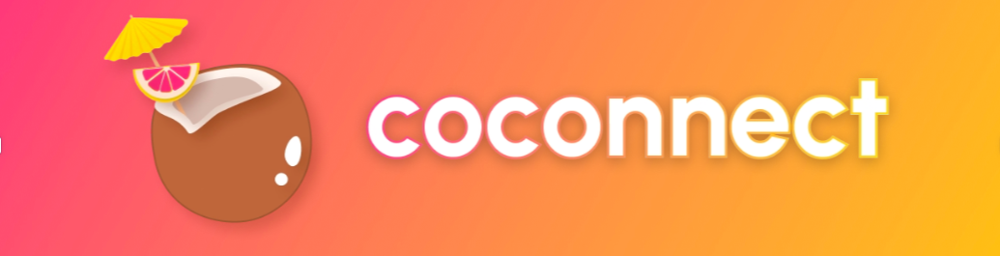

# Coconnet


<div align="center">

</div>

Coconnet is a platform that connects creators with users/business who wants to promote their product or service.

## How does it work?
First, run the development server:

```bash
npm run dev
# or
yarn dev
```

Open [http://localhost:3000](http://localhost:3000) with your browser to see the result.

You can start editing the page by modifying `pages/index.js`. The page auto-updates as you edit the file.

[API routes](https://nextjs.org/docs/api-routes/introduction) can be accessed on [http://localhost:3000/api/hello](http://localhost:3000/api/hello). This endpoint can be edited in `pages/api/hello.js`.

The `pages/api` directory is mapped to `/api/*`. Files in this directory are treated as [API routes](https://nextjs.org/docs/api-routes/introduction) instead of React pages.

## Authors 👦

- Juan Manuel Espejel ([@espejeljuanma](https://twitter.com/espejeljuanma))
- Federico Loterstein ([@fedeloters](https://twitter.com/fedeloters))
- Juan Pablo Hernandez ([@hoocrypto](https://twitter.com/HooCrypto))
- Matias Rodriguez ([@rodriguezmatid](https://twitter.com/rodriguezmatid))

## Contributing ✅
PRs and issues are always welcome. Feel free to submit any issues or ideas you have at the [issues page](https://github.com/Coconnect-ethBogota/coconnect-app/issues).
